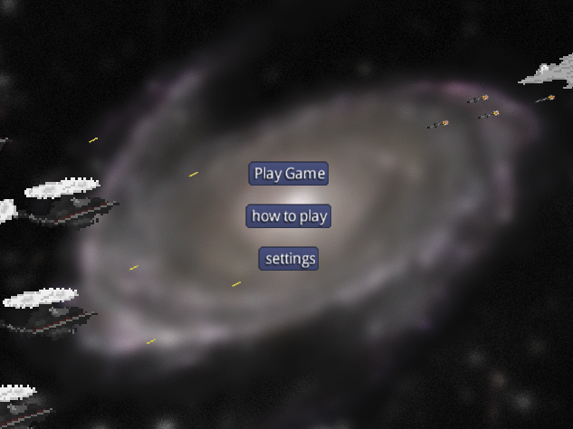

# MLA-Jet-Strike
## Overview

- Made with LibGDX a video game library for java. 

- Main goal is to collect as many JCoins as possible without dying. 

- your life span is described by the green force field around your character. 

- press shift to increase speed.

### Ui
here is a screenshot of the main menu when you being playing

